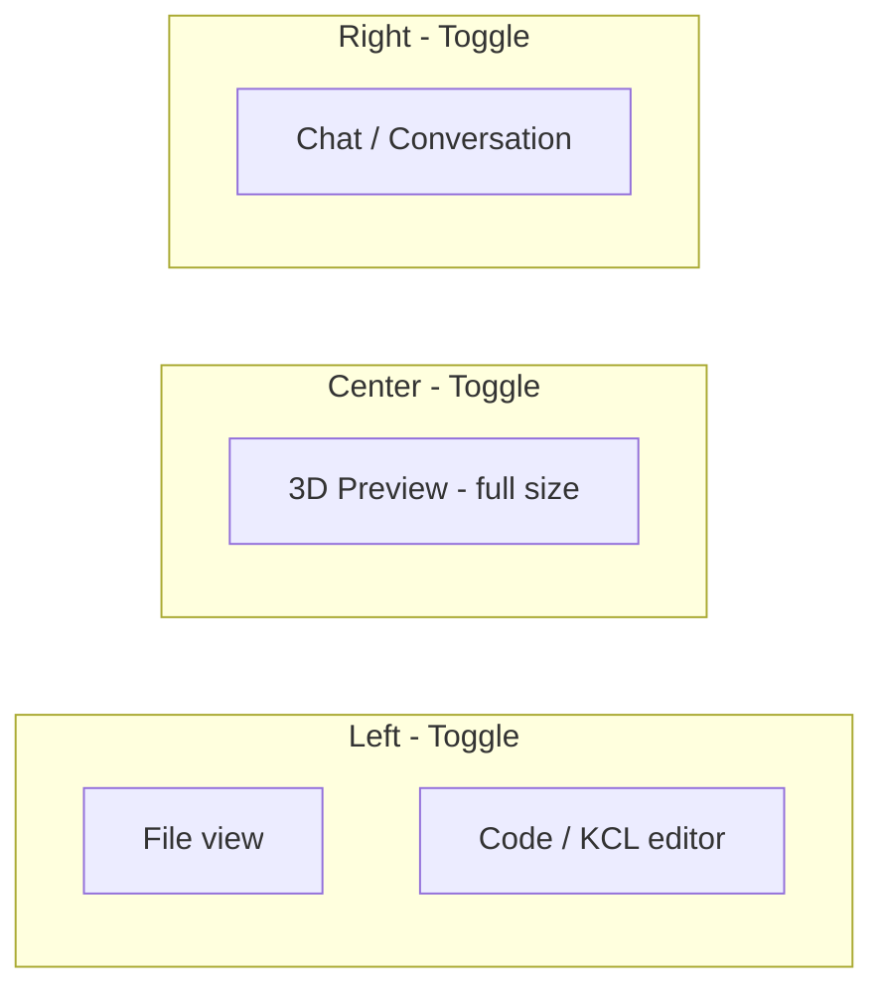

# 다크 UI · Cursor AI 스타일 레이아웃 계획 (수정본)

## 목표
- **Cursor AI 느낌**: 왼쪽 파일/코드, 가운데 3D 프리뷰 꽉, 오른쪽 대화창. 전부 토글 가능.
- **다크 모드** 유지.

## 레이아웃 구조

- **왼쪽 패널 (토글)**  
  - **파일 뷰**: 업로드한 이미지 선택, “Convert to KCL” 등. (필요 시 파일 목록/트리 형태 가능.)  
  - **코드 뷰**: KCL 에디터. 파일 뷰와 코드 뷰는 같은 왼쪽 패널 안에서 탭 또는 섹션으로 전환 가능.  
  - 패널 전체를 토글해서 숨기기/보이기.

- **가운데 (토글)**  
  - **3D 프리뷰만** 꽉 차게. 상단 툴바/헤더 최소화하거나 없애고, 뷰포트가 전체 중앙 영역을 채우도록.  
  - 이 영역도 토글해서 숨기면 다른 패널이 넓어지거나, 레이아웃만 재배치.

- **오른쪽 패널 (토글)**  
  - **대화창(채팅)** 상시 표시. “Modification command” 입력 + Apply, 또는 앞으로의 AI 대화 UI용.  
  - Cursor처럼 채팅 히스토리 + 입력창 구조.  
  - 패널 전체 토글 가능.

- **전체**  
  - 왼쪽 / 가운데 / 오른쪽 각각 토글 가능.  
  - 토글 시 패널 너비는 0 또는 최소(아이콘만)로 줄이고, 나머지 영역은 다른 패널이 채우도록.

## 기술 방향 (요지만)

- **레이아웃**: 상단 툴바 없이 또는 최소(로고 + 전역 액션만). 메인은 3열: `[Left | Center | Right]`. 각 열은 토글 가능한 사이드 패널 컴포넌트로 구현.
- **상태**: 왼쪽/가운데/오른쪽 패널의 “열림/닫힘” 상태를 React state(또는 URL/저장소)로 관리. 토글 버튼은 각 패널 상단 또는 가장자리.
- **스타일**: 기존 다크 테마(globals.css + CSS 변수) 유지. Cursor와 비슷한 어두운 배경, 얇은 구분선, 채팅/코드 영역 구분.
- **3D 뷰포트**: 가운데 열이 열려 있을 때 `KclPreview3D`가 해당 영역 전체를 채우도록 (`width/height: 100%`, flex/grid로 비율 유지).
- **대화창**: 오른쪽 패널에 “Modification command” 입력 + Apply 버튼을 넣고, 이후 확장 시 메시지 리스트 + 입력창 UI 추가.

## 수정/추가할 파일 (요지)

| 대상 | 내용 |
|------|------|
| `app/globals.css` | 다크 테마 변수, 3열 레이아웃용 그리드/플렉스, 패널 토글 시 너비 처리. |
| `app/layout.tsx` | `globals.css` import, body 다크 클래스. |
| `app/page.tsx` | 왼쪽(파일+코드) / 가운데(3D) / 오른쪽(채팅) 구조로 재구성. 각 패널 토글 state 및 토글 버튼. 기존 ImageUpload, KclEditor, CommandInput, KclPreview3D, ErrorDisplay는 해당 패널 안에 배치. |
| 왼쪽 패널 컴포넌트 | 파일 뷰(ImageUpload 등) + KCL 코드(KclEditor)를 탭/섹션으로 묶고, 패널 헤더에 토글 버튼. |
| 가운데 영역 | KclPreview3D만 풀사이즈로 두고, 헤더에 토글 버튼(선택). |
| 오른쪽 패널 컴포넌트 | CommandInput + (선택) 채팅 메시지 영역. 패널 헤더에 토글 버튼. |
| `KclPreview3D` | 부모 컨테이너 100% 채우기, 최소 높이만 유지. |

## 구현 순서 제안

1. **globals.css** · **layout**: 다크 테마 + 3열 레이아웃 기본 스타일.
2. **page.tsx**: 3열 구조 + 왼쪽/가운데/오른쪽 토글 state 및 토글 버튼.
3. **왼쪽 패널**: 파일 뷰 + 코드 뷰 묶고, 토글 가능한 패널로 구현.
4. **가운데**: 3D 프리뷰만 꽉 차게, 토글 시 숨김.
5. **오른쪽 패널**: 대화창(CommandInput + 확장용 UI), 토글 가능.
6. 반응형: 좁은 화면에서는 패널을 오버레이/드로어로 전환할지 결정 후 적용.

## 테스트

- 기존 `data-testid`, `aria-label` 유지. 토글로 DOM 순서/노출만 바뀌므로, 필요 시 테스트에서 패널이 열린 상태를 가정하거나 토글 후 렌더 여부만 검증.

---

**요약**: Cursor AI처럼 왼쪽(파일+코드), 가운데(3D 프리뷰 꽉), 오른쪽(대화창) 3열 레이아웃으로 바꾸고, 세 영역 모두 토글 가능하게 만든다. 다크 모드는 유지.
